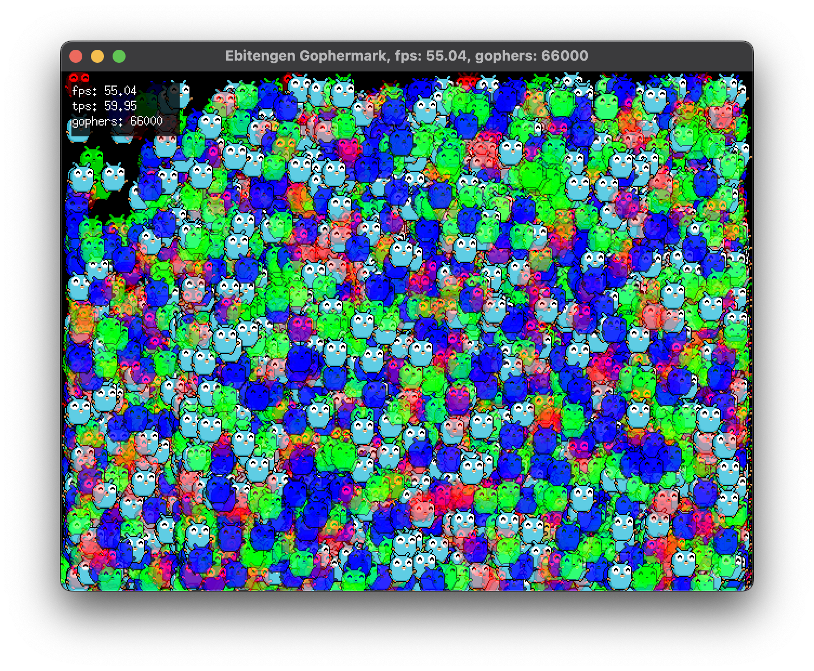

# Gophermark

Bunnymark for [Ebitengine](https://ebitengine.org) but with gophers.



## Usage
```
go run .
```

## Reasoning

I was curious how Go + Ebitengen stacks up against [LÖVE](https://love2d.org/) in this test. Note: no optimization has been done.

## Credits, License

`gopher.png` was created by Bapak on the Go Discord.

Code is in the public domain.

